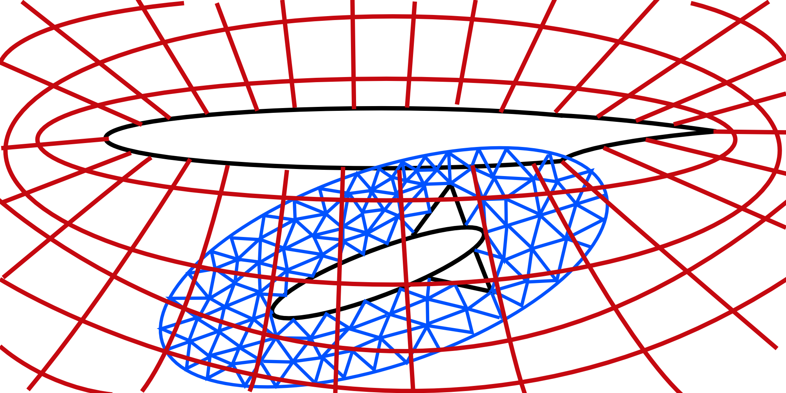

Domain
======

T-infinity is a multi-domain framework.
A domain is defined on a singe MPI communicator and must consist of:
  - A partitioned mesh.
  - A domain solver (fluid or structural).
Within a domain additional plug-ins may be used including:
  - Mesh adaptation
  - Mesh deformation
  - Pre-processor
  - Visualization

Almost all plug-ins within the framework operate only on a single domain.
This simplifies development of plug-ins and allows the use of an arbitrary number of domain combinations.

Domain couplers are plug-ins that operate across multiple domains.  
The only currently existing example of a domain coupler is the overset assembler.

