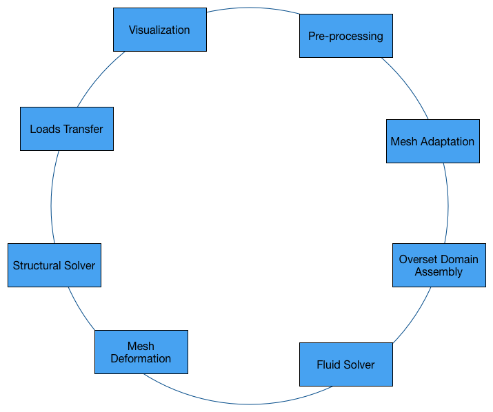

T-infinity
==========
:math:`T^{\infty}` is an extensible framework for multiphysics applications.

.. toctree::
   :maxdepth: 2

   domain
   mesh
   field
   pre-processor
   mesh-adaptation
   metric-field-calculator
   mesh-deformation
   overset-domain-assembly
   fluid-solver
   structural-solver
   transfer-scheme
   visualization
   examples
   contact
   proposals
