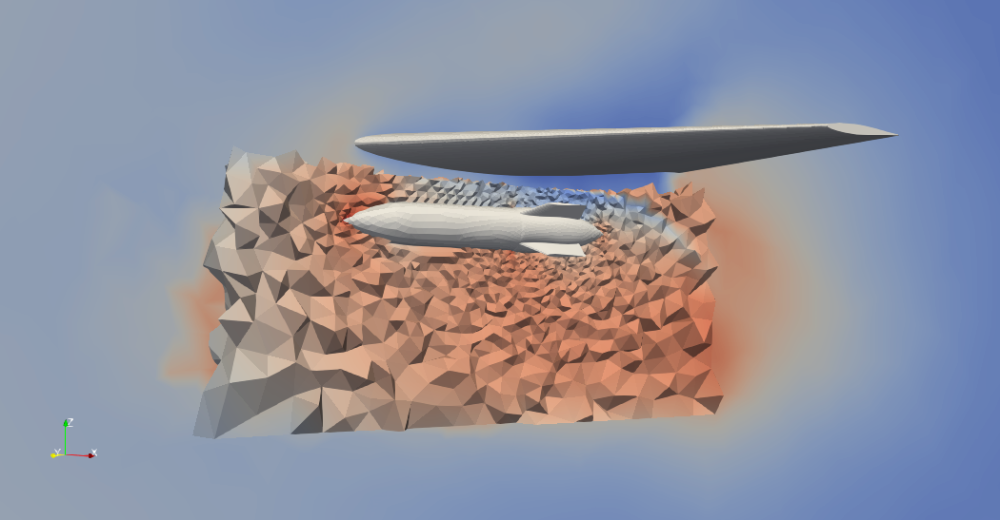

Overset Assembler
=================
The Overset Assembler is responsible for determining where to place 
overset boundaries, identifying which regions of the domain are not 
to be solved by the Fluid Solver, identifying receptor nodes, and donor cells,
and transferring donor solution information from a donor cell to a receptor node.

The Overset Assembler is constructed on each MPI that is assigned a Mesh partition 
that is part of the overset grid system.  
On construction the Assembler is passed the Mesh partition resident on that rank,
and the domain id the mesh is part of.  
The Assembler is also passed an MPI comm.
This is not the communicator the domain is assigned to.  
Instead this is a communicator that is shared across all domains in the overset grid system.
This is where the Overset Assembler is unique, it operates across domains.

On construction, the Overset Assembler should perform an initial overset cut identifying 
frozen regions of the mesh, and identifying donor cells and receptor nodes. 
The Overset Assembler is not responsible for determining how to interpolate from donor cells.
It is also not responsible for knowing what the solution is that must be transferred between 
donors and receptors.  Instead, when performing solution transfer from donors to receptors
the Assembler must be provided a callback function.  The callback function will take 
the cell id of the donor cell, and an xyz coordinate inside that cell.  
The callback must provide the solution at that xyz coordinate.  
The callback function is responsible for knowing how to interpolate to the requested xyz location. 
The callback is only called on the partition that owns the cell.  
The solution will be transferred only to the MPI rank that owns the receptor node. 

